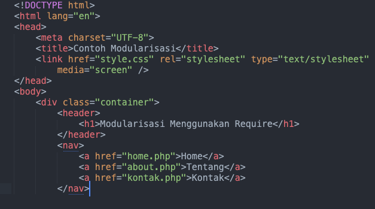
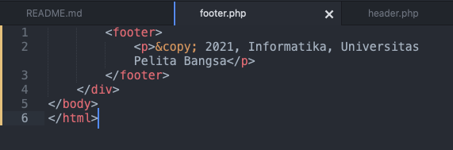
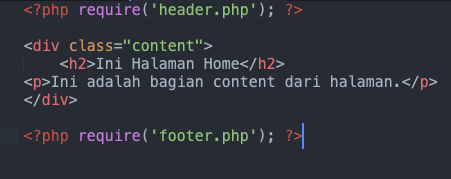
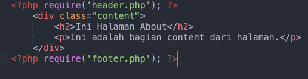
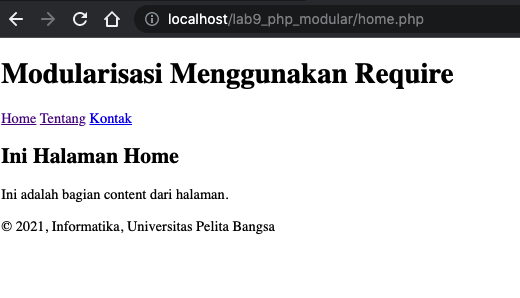
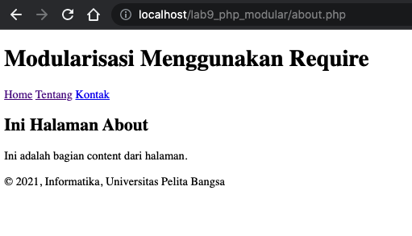
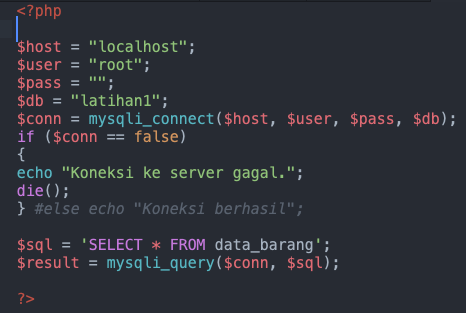

| Nama      | Fajar Agung Nugroho |
| ----------- | ----------- |
| NIM     | 312010448       |
| Kelas   | TI.20.A.1        |

## Langkah langkah praktikum 8

## 1. Buat file baru dengan nama header.php



## 2. Buat file baru dengan nama footer.php



## 3. Buat file baru dengan nama home.php



## 4. Buat file baru dengan nama about.php



## 5. Output





## Pertanyaan dan Tugas
Implementasikan konsep modularisasi pada kode program praktikum 8 tentang database, sehingga setiap halamannya memiliki template tampilan yang sama.

### berikut struktur direktori yang saya buat

```
lab8_php_database
├── config
│   ├── hapus.php
│   ├── koneksi.php
│   ├── tambah.php
│   └── ubah.php
├── layouts
│   ├── footer.php
│   ├── head-static.php
│   ├── header.php
│   ├── main.php
│   ├── tambah.php
│   └── ubah.php
├── static
│   ├── css
│   │   └── style.css
│   └── img
├── index.php
├── tambah.php
└── ubah.php
```

### config
dalam folder tersebut menyimpan file khusus php yang nanti akan dieksekusi 

Koneksi.php

